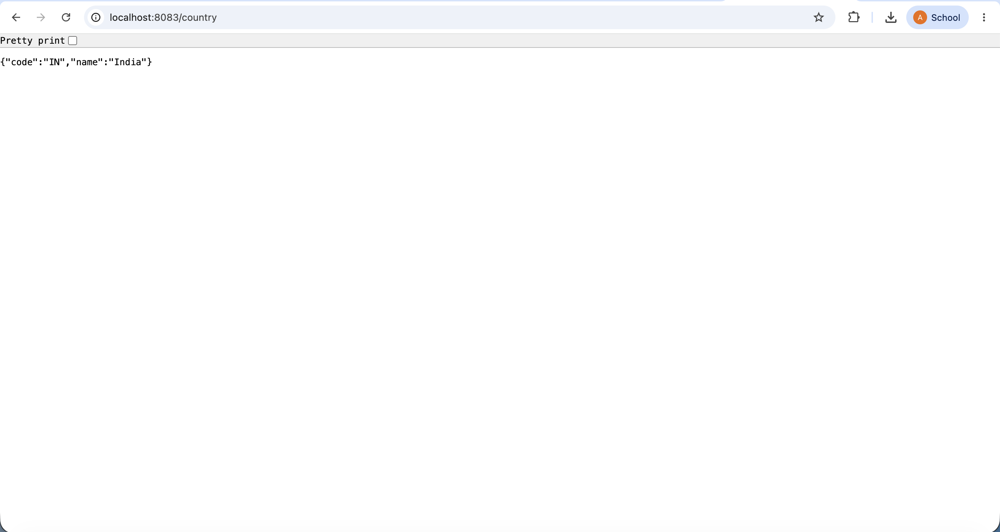

# Hello World RESTful Web Service

Here is the output of the completed web service running on localhost:8083:

---

# REST - Country Web Service

Here is the JSON output of the Country web service running on localhost:8083/country:

