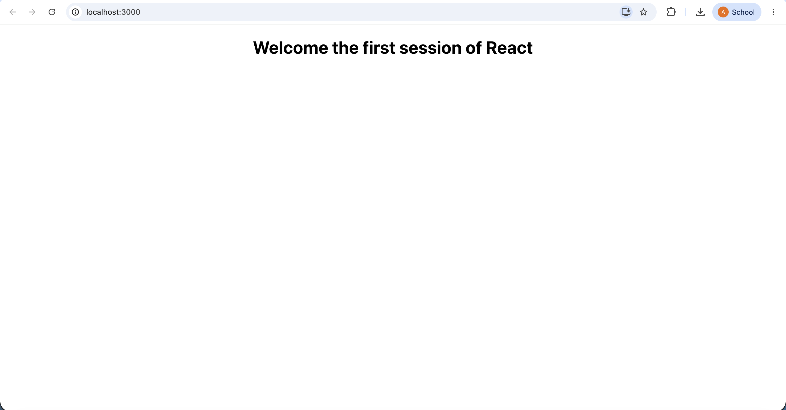

# Week 5: Introduction to ReactJS

## Overview
This repository contains the hands-on exercise for Week 5, which introduces Single-Page Applications (SPAs) and ReactJS fundamentals.

## Objectives Achieved
* Set up a local React development environment.
* Installed `create-react-app` globally via NPM.
* Generated a new React application named `myfirstreact`.
* Modified the root `App.js` component to render custom text.
* Applied inline CSS styling to center the output on the screen.

## Technologies Used
* **ReactJS**
* **Node.js & NPM**
* **HTML/JSX & CSS**

## How to Run
To run this application locally:
1. Open a terminal and navigate to the project folder:
   ```bash
   cd "Week 5/myfirstreact"
   ```
2. Start the development server:
   ```bash
   npm start
   ```
3. The application will be available in your browser at `http://localhost:3000`.

## Output Screenshot
Below is the final output of the React application running locally, demonstrating the updated and centered text component:

