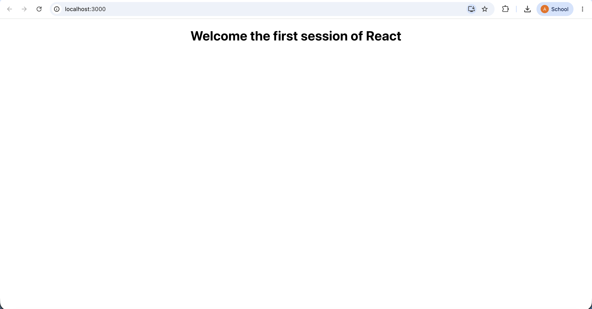
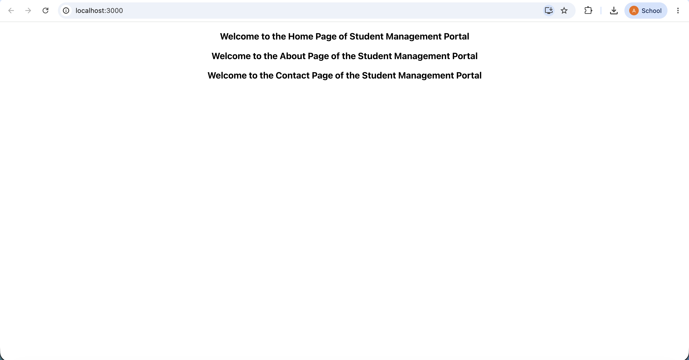
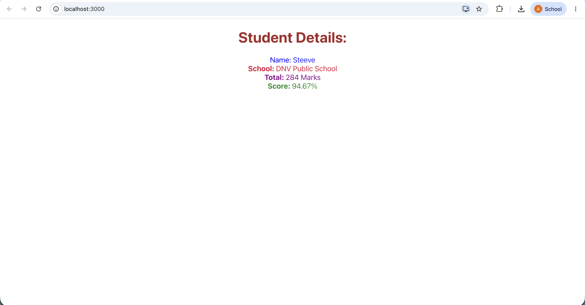
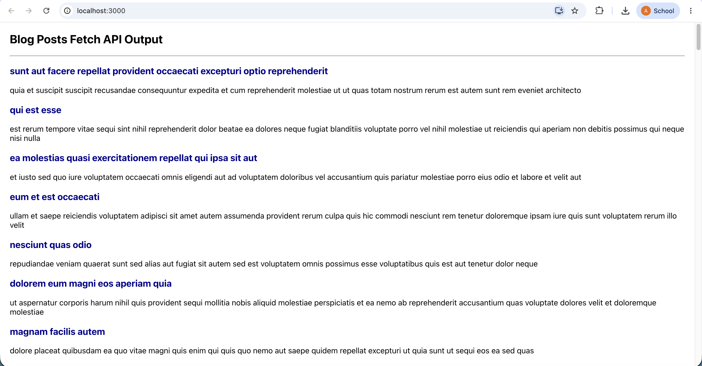

# Week 5: ReactJS Introduction & Components

## Overview
This repository contains the hands-on exercises for Week 5, focusing on Single-Page Applications (SPAs), setting up a local React environment, building class components, using functional components with props, and utilizing component lifecycle methods.

---

## Exercise 1: MyFirstReact App
* **Objective:** Set up a React development environment using `create-react-app` and render a centered heading.
* **How to run:** 
  1. Navigate to the project folder: `cd "Week 5/myfirstreact"`
  2. Start the server: `npm start`

### Output Screenshot

---

## Exercise 2: Student Management Portal (StudentApp)
* **Objective:** Create a React application utilizing multiple class components (`Home`, `About`, and `Contact`) and render them simultaneously from the main App component.
* **How to run:** 
  1. Navigate to the project folder: `cd "Week 5/studentapp"`
  2. Start the server: `npm start`

### Output Screenshot

---

## Exercise 3: Score Calculator App
* **Objective:** Create a functional React component (`CalculateScore`), pass data into it using props, and apply custom CSS styling.
* **How to run:** 
  1. Navigate to the project folder: `cd "Week 5/scorecalculatorapp"`
  2. Start the server: `npm start`

### Output Screenshot

---

## Exercise 4: Blog App (Lifecycle Hooks & Fetch API)
* **Objective:** Implement the `componentDidMount()` lifecycle hook to fetch data from an external API (`jsonplaceholder`) and render it using a custom class component.
* **How to run:** 
  1. Navigate to the project folder: `cd "Week 5/blogapp"`
  2. Start the server: `npm start`

### Output Screenshot
