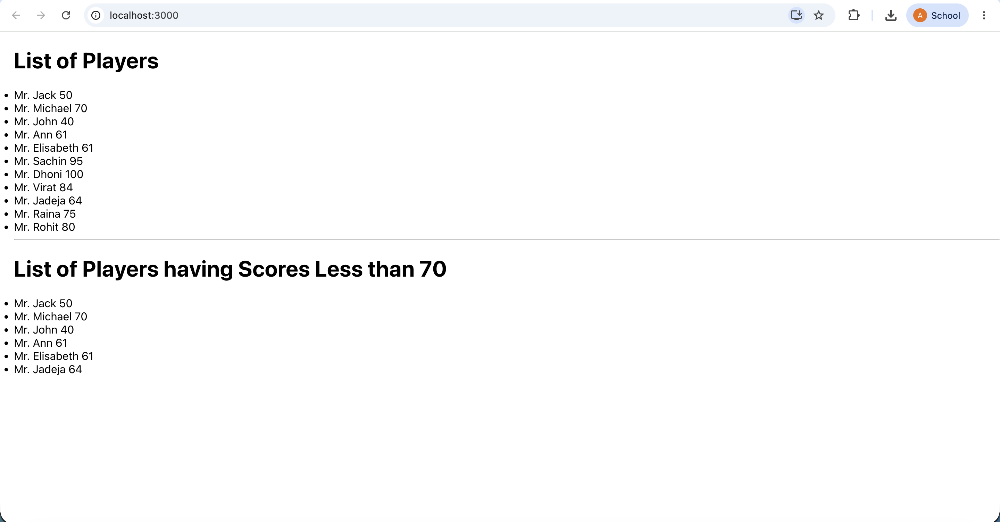
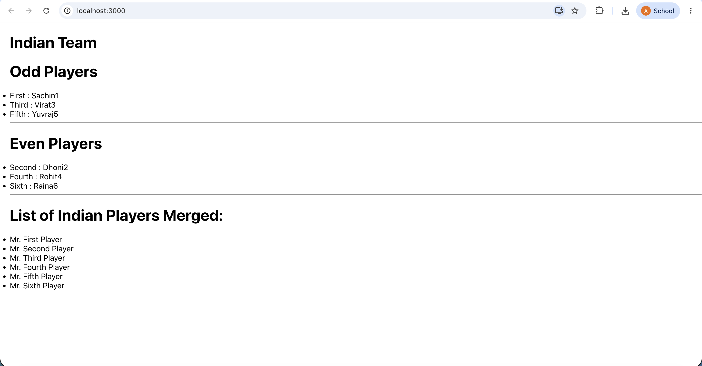
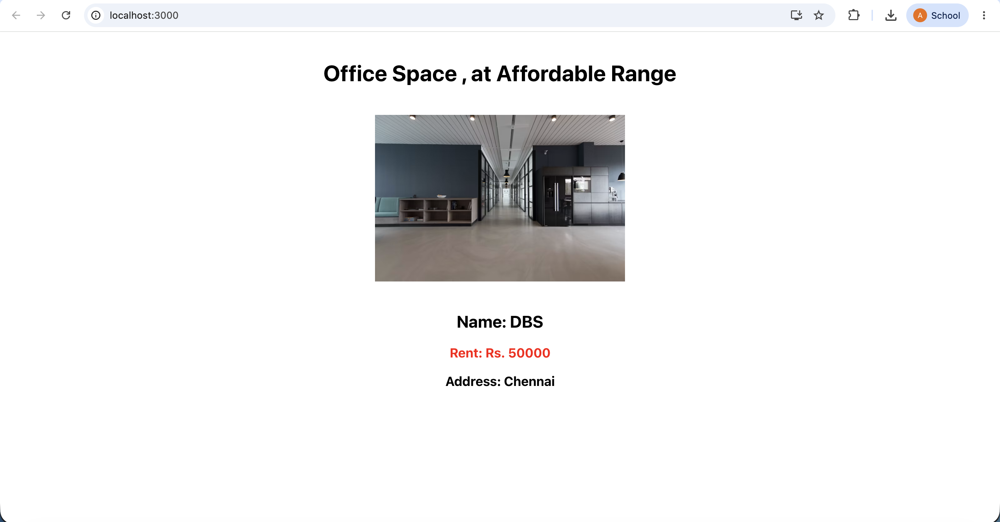
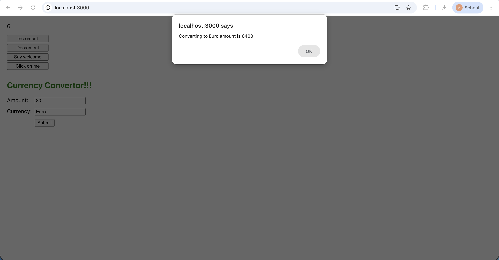

# Week 6: ES6 Features in React

## Overview
This repository contains the hands-on exercises for Week 6, focusing on integrating modern ES6 JavaScript features within React applications.

---

## Exercise 9: Cricket App
* **Objective:** Utilize ES6 array mapping, filtering logic, array destructuring, and the spread operator (`...`) to manage and display lists of data.
* **How to run:** 
  1. Navigate to the project folder: `cd "Week 6/cricketapp"`
  2. Start the server: `npm start`

### Output Screenshot (Flag = True)
*Displays the mapped list of players and the filtered list of players with scores <= 70.*

### Output Screenshot (Flag = False)
*Displays the destructured odd/even Indian team players and the merged list of Indian players.*

---

## Exercise 10: Office Space Rental App (JSX & Inline CSS)
* **Objective:** Utilize React JSX syntax to create elements and attributes, render dynamic DOM elements by mapping over an object array, and apply conditional inline CSS styling using JavaScript expressions.
* **How to run:** 
  1. Navigate to the project folder: `cd "Week 6/officespacerentalapp"`
  2. Start the server: `npm start`

### Output Screenshot
*Displays the mapped office space data with conditional red styling for rent <= 60,000.*

---

## Exercise 11: Event Examples App
* **Objective:** Implement React event handling, use synthetic events, pass arguments to event handlers, and manage form submissions using state.
* **How to run:** 
  1. Navigate to the project folder: `cd "Week 6/eventexamplesapp"`
  2. Start the server: `npm start`

### Output Screenshot
*Displays the interactive counter, parameter-driven event buttons, and the currency converter form.*
